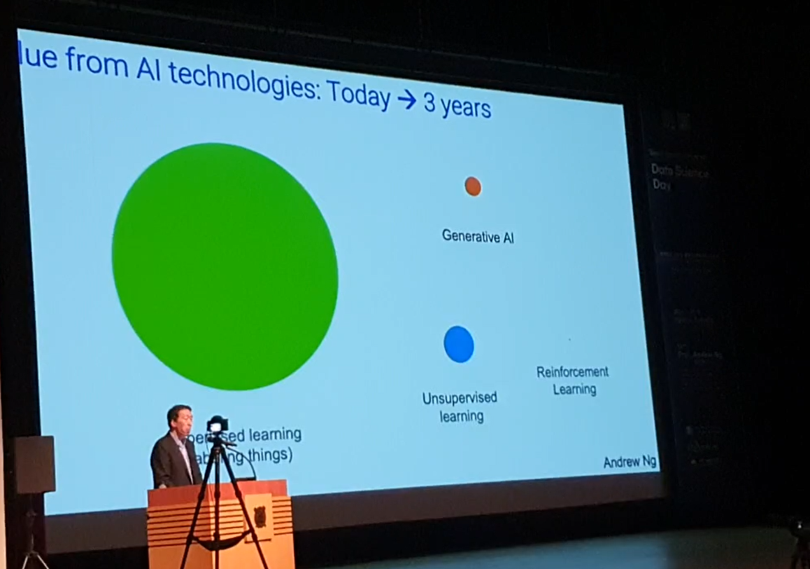

# 서울대 데이터 사이언스 데이 Andrew Ng 교수님 강의

1. [서울대 선도 연구센터 개소식](#서울대-선도-연구센터-개소식)

2. [앤드류 응 교수님 강의](#technology-landscape)

    a. [technology landscape](#technology-landscape)
    
    b. [AI 산업의 미래와 지속 가능성](#ai-산업의-미래와-지속-가능성)
    
    c. [AI의 위험요소와 사회적 파장](#ai의-위험요소와-사회적-파장)

## 서울대 선도 연구센터 개소식

- 초거대 AI의 모델 기술의 문제
    1. 플랫폼, 알고리즘, 응용 개발 주체 간의 소통 및 최적화 부재
    2. 플랫폼의 성능 전력 장벽
    3. 모델의 거대한 크기 그 자체
    4. 한국어 기반 초거대 모델 AI의 학습 데이터의 상대적인 질저하
        1. 학습 데이터
        2. 한국어 tokenizer
        3. 비식별화도구
        4. 신뢰성

## 앤드류 응 교수님 강의

### technology landscape

- **AI의 지난 10년**
    - 지도 학습의 포션이 매우 컸다.
        
        
        
    - 대규모 데이터로 작은 모델을 학습 시켰을 경우 성능이 향상 되다 정체 되는 경향이 강했음
        
        
        
    - 따라서, 앤드류 응 교수 본인이 지난 10년 동안 빅 테크 기업과 해왔던 일은 그런 대규모의 모델을 만드는 것이었음. ⇒ 이 부분은 현재의 LLM(Large Language Model)의 혁혁한 성과와 성능에 비추어 볼 때, 가장 모던한 트렌드에 가까움
        
        
        
- **AI의 미래의 10년**
    - 지도 학습은 여전히 사용되는 분야가 넓고 종사자도 많기 때문에 기존에서 약 2배의 성장을예상한다.
    - 앞으로는 생성형 AI의 시대가 도래할 것이다. 지도 학습의 포션을 뛰어넘는 것은 불가능하지만, 기존 생성형 AI의 몇 배에 달하는 포션을 얻게 될 것이다.
    
    
    

- **기존의 AI 서비스 프로세스**
    
    
    
    1. 데이터 수집
    2. 모델 개발
    3. 클라우드 배포
    4. 사업화
    - 기존의 AI 서비스 사업이 위의 단계를 거쳐 사업화까지 가는데 걸리는 속도는 평균적으로 6개월 ~ 12개월 까지 소요되었다. 하지만, 프롬프트를 사용하여 개발을 한다면 더 적은 시간을 소요하여 개발이 가능하다.
    
    <aside>
    💡 이 부분과도 관련하여 아래의 ‘어려운 문제를 해결’ 해야 지속 가능한 사업 모델을 생성 가능하다는 것에 동의한다. 프롬프트를 통한 개발이 개발의 속도와 난이도를 드라마틱하게 낮추었기 때문에 충분히 성숙한 기술과 서비스가 아니면 손쉽게 누구나 따라하는 것이 가능하기 때문이다.
    
    </aside>
    

### AI 산업의 미래와 지속 가능성

- **IT 서비스 소비자 산업의 지형도**
    
    
    
    - 현재 IT 소비자 서비스 지형에서 가장 많은 지분과 가장 많은 자본, 가치를 창출해내는 IT 소비자 서비스 분야는 광고와 검색 분야이다. (AWS, Google 등의 빅 테크 기업의 진출 분야)
    - AI 서비스의 산업 점유율 자체도 낮다. 더불어서, 가치의 규모 또한 크지 않다. (프로젝트 당 약 50억 규모 - 미국 기준)
    - 하지만, 개별 AI 서비스가 수만 가지에 이르기 때문에 (앤드류 응 교수 개인의 의견으론), 작은 AI 서비스 합의 총 가치가 앞 선 광고, 검색 분야의 가치보다 클 것으로 예상함.
- **AI 산업의 지형도**
    
    
    
    - AI 산업의 지형은 총 4가지의 산업 분야로 이루어짐
        1. 하드웨어 분야 - Intel, Nvidia, AMD
            1. 매우 자본 집중적인 산업이므로, 이 산업군에 끼어들어 경쟁하는 것은 불가능에 가까움
        2. 인프라 분야 - AWS, GCP, Azure
            1. AI를 서비스하기 위한 클라우드 컴퓨팅 분야
            2. 이 역시 매우 자본 집중적인 산업이므로, 이 역시 경쟁이 불가능함
        3. 개발 툴 분야 - OpenAI, HuggingFace, Pytorch, TensorFlow
            1. 현재 매우 경쟁이 치열한 분야
            2. 확실하게 자기만의 솔루션을 보유한 기업은 승자가 될 수 있겠지만, 그 전까진 장담 못함.
            3. 현재 가장 언론과 정부, 산업에 관심을 갖고 있는 분야
        4. AI application 분야
            1. AI 서비스 분야
            2. 앤드류 응 교수 본인이 가장 중요하게 생각하는 분야
            3. 현재 가장 잠재적인 가치가 높은 분야이고, 스타트업들이 뛰어들기에 적합한 분야.
    - 앤드류 응 교수는 현재 관계자들에게 가장 강조되어 있는 3번 분야와 관련해서, 3번 분야의 산업이 앞으로 성공적이기 위해서는 4번의 AI application 분야의 확대와 성공이 필수적이라 보았음. 그 이유는 AI 서비스를 론칭하는 기업이 많아질 수록 개발 툴을 사용하는 기업이 많아진다는 의미이고 전체 시장의 파이가 확대되는 길이라 보았음.
- **AI 산업의 지속가능성**
    - 쉬운 문제가 아닌 어려운 문제를 해결해야 한다. 어렵고 복잡한 문제를 해결할 때, 지속 가능한 사업 모델이 생성 가능하다.
        - Lensa : 프로필 사진을 꾸며주는 AI 서비스 어플리케이션이었다. 한 때, 매우 큰 인기를 끌었지만 현재는 사업이 붕괴했다. 그 이유로는 매우 쉽고 얕은 문제를 해결해주는 앱이었기 때문이다.
        - 우버, 틴더, 등등의 서비스 : AI 서비스가 매우 구체적이고 복잡한 문제를 해결하는데 사용된다. 아직까지 매우 큰 가치를 창출하고 있는 서비스이며, 앞으로도 그럴 것이다.
    
    <aside>
    💡 위와 관련해서, 개인적인 사견으로는 공감하는 바이다. 현재, AI 모델의 발전 속도와 별개로 개발 툴의 개발 난이도는 점점 내려가고 있다. 즉, 약간의 AI 지식과 코딩 지식만 있다면 언제든지 손쉽게 모델을 사용 가능해지고 있는 것이다. 우스개 소리로 현직자들 사이에서도 AI researcher는 이제 석,박 급만 남게 되고 나머지는 전부 AI 서비스 개발자가 될 것 이다라는 말도 있다.
    
    </aside>
    
- **AI 산업의 프로세스**
    - 위의 이야기를 종합해서 보았을 때, 성숙한 AI 서비스를 다채롭게 내는 것이 가치 창출에 도움이 된다는 것을 알 수 있었다. 하지만, 하나의 조직의 팀이 저런 다양한 서비스를 서비스하는 것은 불가능하고 비효율적이기 때문에, 각각의 서비스에 대해 스타트업을 창업하여 서비스하는 것이 가장 효율적임을 알았다.
    - **AI 스타트업 서비스 프로세스**
        1. 사업 검증
        2. CEO 선정
        3. CEO와 함께 사업 개발
        4. 성장을 향한 진행
        
        - 앤드류 응 교수는 위와 관련해서 AI 전문가의 역할이 중요하다고 강조한다. 첫번째로, 사업성이 있고 그러한 AI 모델이 개발 가능한지에 대해 검증을 할 수 있고, 두번째로, 팀에 지속적인 기술 전문성을 투여 가능하기 때문에 AI 전문가의 역할을 강조하였다.

### AI의 위험요소와 사회적 파장

- AGI (Artificial General Inteligence)
    - AGI는 단시간에 개발이 불가능함 (15~50년 사이로 개발할 것으로 기대함)
    - AI의 개발은 점진적으로 이루어짐, 따라서 강력한 성능에 대해서도 충분히 대비 가능
    - 이미 인류는 역사적으로 강력한 객체에 대한 관리와 통제를 효과적으로 해왔음. 예) 법인
    - 오히려 앞으로 인류가 처한 위협을 해결하는데 도움이 될 수 있는 유일한 해결책이 될 가능성이 높다.
- AI와 일자리
    
    
    
    - 기존의 자동화는 낮은 임금의 일자리에서 주로 이루어졌으나, 이제는 더 이상 아니다.
    - 현재는 높은 임금의 업무와 해당 업무의 AI 노출도는 매우 높다. 따라서 현실적으로 대체 가능한 영역으로 왔다.
    - 하지만, 그렇다고 AI의 개발을 멈추는 것은 어리석은 일이다. 따라서 이러한 현실적인 문제를 고려하면서 개발을 진행해야 한다.